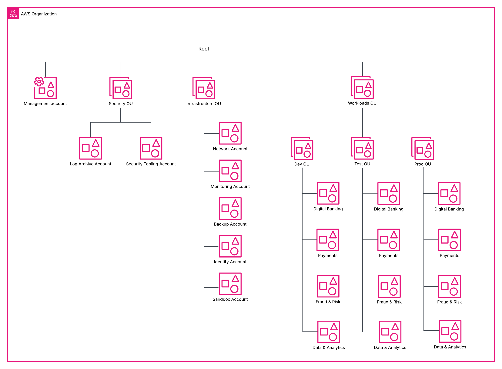
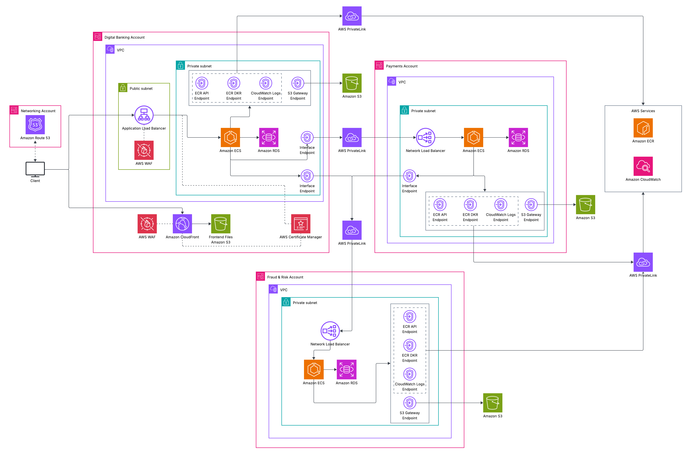
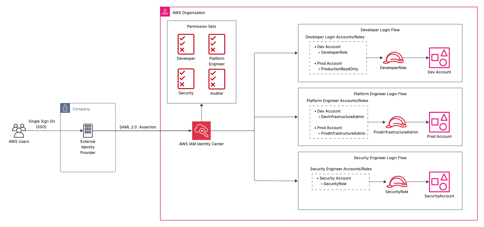

# Enterprise AWS Landing Zone
This project presents a secure, multi-account AWS landing zone for a financial enterprise environment. This project includes diagrams and architectural decisions of proper governance, networking, identity and access management, security, logging, and monitoring flows commonly found in enterprise AWS environments. This is an architecture-first project currently being implemented with Terraform.

## Organization Architecture

I implemented AWS Organizations to create a multi-account setup and provide centralized management of all accounts. Organizational Units are used to further separate accounts that share similar security or resource needs. Enterprises consist of several teams, workloads, and business operations so it is important to isolate these entities using different accounts. With AWS Organizations, you can attach SCPs to OUs to establish the maximum available permissions for each account under them instead of redundantly attaching SCPs to individual accounts that share similar security needs. Attaching SCPs to OUs also decreases the number of policies you would have to modify and provides easier onboarding for new accounts.

### Management Account
This account is in charge of managing all OUs and accounts. Teams can use this account for centralized governance and billing for the entire organization.

### Security OU
This OU contains accounts that are used to store logs from all accounts and secure the entire organization from one place.
- Log Archive Account: Used to store logs from across all accounts for better organization and visibility.
- Security Tooling Account: Used to configure security settings/policies, view security alerts, and set up remediations for noncompliant permissions across the entire organization.
  
### Infrastructure OU
This OU contains accounts used to operate and manage infrastructure.
- Network Account: Used by teams to manage the network infrastructure.
- Backup Account: Used to manage and store copies of data across the organization.
- Monitoring Account: Used to monitor workloads and set up metrics for CloudWatch alarms.
- Identity Account: Used to centralize access management and be the delegated account for IAM Identity Center.
- Sandbox Account: Used by teams for experimental purposes.

### Workloads OU
This OU contains three other OUs (Dev, Test, and Prod) that will hold accounts for each workload. If workloads are closely related and have similar security measures, they can be put into the same account.

## Network Architecture

This network diagram illustrates three production workloads that reside in separate accounts and VPCs to reduce the blast radius in case of an attack and improve security. 

### Digital Banking VPC
This VPC consists of both public and private subnets. The public subnet holds an application load balancer to provide an entry point to the workloads held in the private subnets. All workloads in this diagram are deployed as Amazon ECS services running on AWS Fargate. With ECS Fargate, AWS provisions, configures, and scales containers so you don't have to, so I chose this launch type to minimize operational overhead.

The account where this VPC lies holds the CloudFront distribution and S3 bucket where the front-end files will be stored. CloudFront will use edge locations for decreased latency and fast delivery of the files stored in S3. Both the ALB and CloudFront use WAF to help monitor and control access to these public entry points. 

### Payments VPC
This VPC only consists of private subnets. The Digital Banking VPC will need to access payment information from the workloads in this VPC. This connection is established through an interface endpoint, PrivateLink, and a network load balancer. The NLB provides the entry point for the payment workloads and must also reside in a private subnet.

### Fraud VPC
This VPC also consists of private subnets only. The workloads in this VPC are accessed by the workloads in the previous two VPCs. The workloads in the other VPCs will send information such as sign in attempts and transaction data to this VPC so the fraud workloads can investigate any suspicious activity. The NLB again provides an entry point to these workloads.

### Interface/Gateway Endpoints
I have added several other interface endpoints to each VPC the containers can access AWS services securely using PrivateLink instead of exposing them to the internet. The containers need to send logs to CloudWatch and also pull images from ECR and S3.
The interface endpoints will be deployed across two AZs. Deploying two centralized NAT Gateways instead would reduce costs, however the architecture would have to be redesigned to allow connectivity between all VPCs using Transit Gateway. I specifically did not use Transit Gateway because the VPCs do not need broad connectivity with each other. Also, interface endpoints reduce the attack surface for this network. Two NAT gateways deployed in each VPC could also be an option but a very expensive one.

S3 gateway endpoints do not use PrivateLink like regular interface endpoints. Gateway endpoints connect directly to the service and are completely free to use so I made sure to add those where needed.

## Security, Observability, & Audit Architecture

This diagram features architecture for security, observability, and audit operations. 

### Threat Detection & Security Operations
This diagram represents how threats for the entire organization are detected and remediated. AWS Security Hub gathers findings from Amazon GuardDuty, Amazon Inspector, and IAM Access Analyzer in one place for the entire organization so security teams don’t have to check each service individually. If needed, AWS Config and AWS Security Hub will send findings to Amazon EventBridge to filter which resources need to be remediated with AWS Systems Manager and/or which findings should be sent to Amazon SNS for teams to be alerted. This design not only alerts teams of suspicious activity but automatically remediates time sensitive security threats that engineers might not be able to handle immediately which improves response times and maximizes security operations. 

### Audit & Compliance Logging
This organization stores all of its security related logs in a centralized S3 bucket for forensic investigations and archiving. All logs are sent to a single bucket for secure monitoring and control over the access to the bucket. The bucket is only accessible by authorized individuals and any changes to the IAM policies will go through a strict review process and will follow the principal of least privilege. 

## Access Flow Architecture

